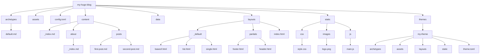

## HUGO
The world’s fastest framework for building websites
Hugo is one of the most popular open-source static site generators. With its amazing speed and flexibility, Hugo makes building websites fun again.


## Getting Started
Step1: Install Hugo and verify version 
```
winget install Hugo.Hugo.Extended
hugo version
```

Step2: Create a Website with YML configuration 
```
hugo new site my-hugo-blog -f yml

```

### Check the Folder Structure 



### Link:
[Hugo](https://gohugo.io/)
